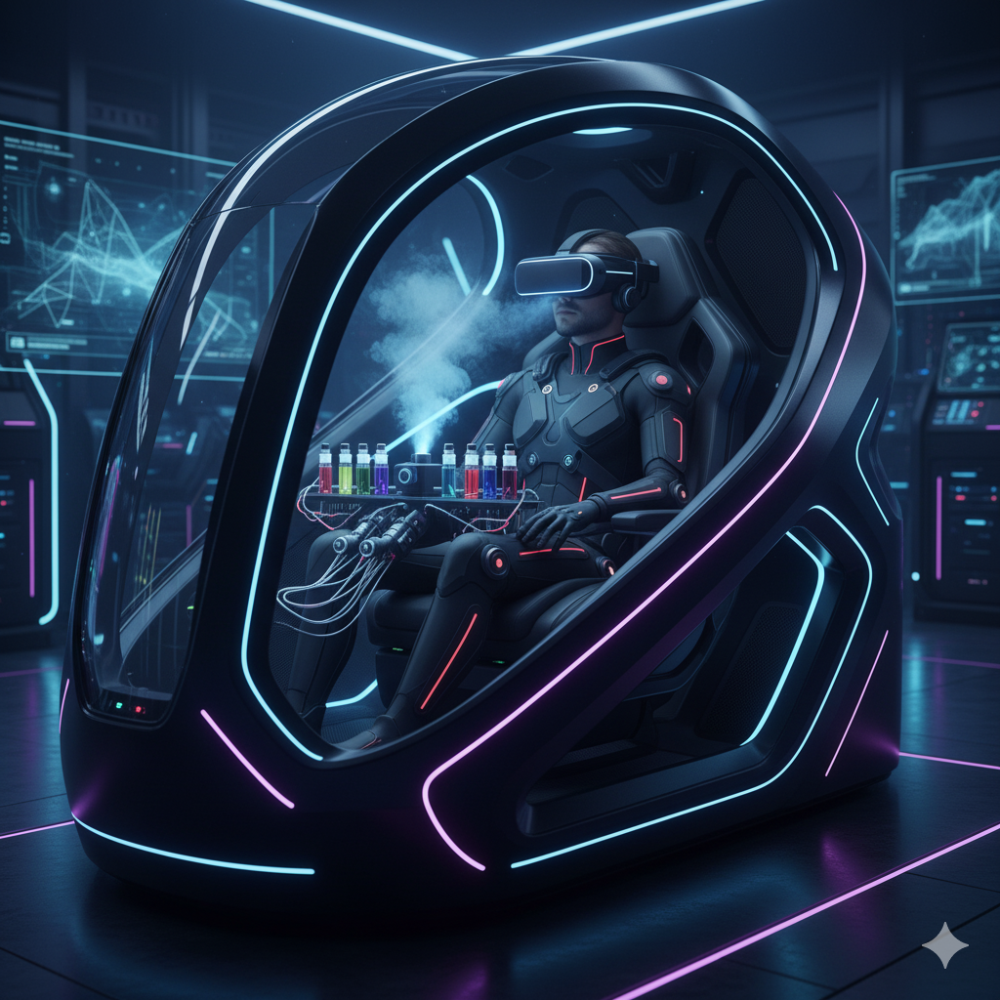

# Sentient Core - Immersive Digital Experience Platform

## 🌐 Live Demo
[**https://ezhakrnwn.github.io/SentientCore/**](https://ezhakrnwn.github.io/SentientCore/)

## 💡 About
Sentient Core is a revolutionary sensory immersion platform designed to redefine the boundaries between reality and virtual worlds through advanced haptic, olfactory, and thermal feedback systems.

## ✨ Features
- Full sensory immersion (haptic feedback)
- Real-time environmental interaction  
- Advanced VR integration
- Multi-sensory experience layers
- Futuristic UI/UX design

## 🛠️ Technology Stack
- HTML5, CSS3, JavaScript
- GitHub Pages (Hosting)
- Responsive Design

## 🚀 Getting Started
1. Visit the live demo above
2. Explore the interactive timeline
3. Check out the concept gallery

## 👨‍💻 Author
**A. Ezha Kurniawan**
- 📧 Email: ezhakrnwn@gmail.com
- 💼 GitHub: [EZHAKRNWN](https://github.com/EZHAKRNWN)
- 🔗 LinkedIn: [Agustya Ezha Kurniawan](https://www.linkedin.com/in/agustya-ezha-kurniawan-863892215/)

## 📄 License
This project is licensed under the MIT License - see the [LICENSE](LICENSE) file for details.
